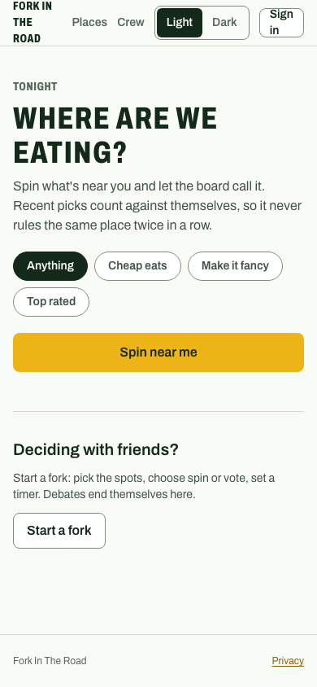
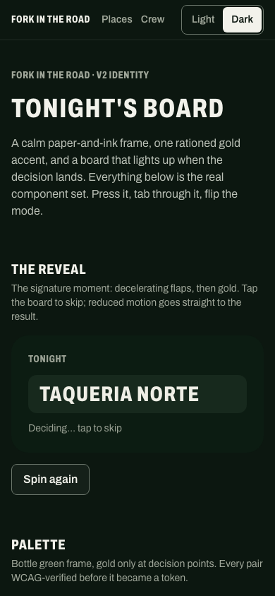
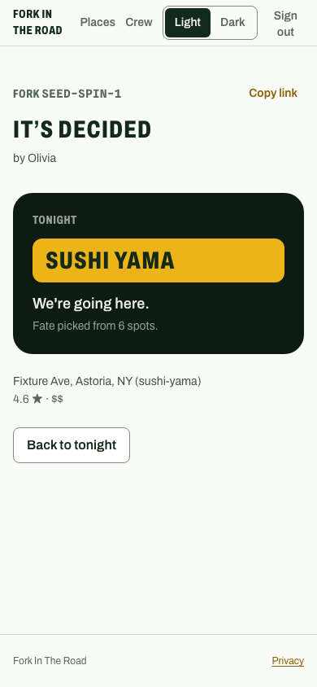
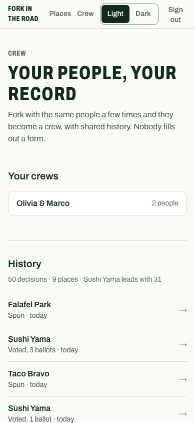

# Fork In The Road

**End the "where should we eat?" debate.**

[](https://github.com/akpersad/YouHungry/actions/workflows/ci.yml)
[](https://github.com/akpersad/YouHungry/actions/workflows/playwright.yml)
[](https://github.com/akpersad/YouHungry/actions/workflows/ci.yml)
[](https://github.com/akpersad/YouHungry/actions/workflows/ci.yml)

Fork In The Road is a mobile-first PWA for the moment a group chat stalls on
dinner plans. Someone starts a **Fork** — a lightweight decision with a few
candidate spots, a mode, and a timer — and drops one link into the chat.
Everyone votes **with just a display name, no account**. When the fork
closes, the board flips, the winner floods gold, and the debate is over.

**Live at [fork-in-the-road.vercel.app](https://fork-in-the-road.vercel.app)**

> The repository is named `you-hungry` for historical reasons; the product
> name is Fork In The Road. This is the v2 re-imagination — the v1→v2 story
> (~113k lines of v1 down to ~20k of v2) is told in
> [`docs/portfolio-story.md`](./docs/portfolio-story.md).

|              The cold open               |                 The theater                 |                 The decision                 |                The memory                |
| :--------------------------------------: | :-----------------------------------------: | :------------------------------------------: | :--------------------------------------: |
|  |  |  |  |

---

## The product in three lanes

1. **Fork (the core).** Two taps from cold open to a decision: pick a vibe,
   spin what's near you. Or start a group fork — spin or ranked vote, a
   timer from 15 minutes to 2 hours, optional quorum, one shareable link.
   Nothing requires an account until you want to keep something.
2. **Places (the accelerant).** Search, save, and organize spots into lists.
   "Fork this list" pre-fills a ballot. Saving IS list membership — there is
   no separate saved flag to drift out of sync.
3. **Crew (the memory).** When the same accounts finish three forks
   together, the app suggests making it a crew. Crews share decision
   history, so "we just went there" counts no matter who spun, and one tap
   re-runs the last ballot.

## How it decides

The decision engine ([`src/lib/v2/decision-engine.ts`](./src/lib/v2/decision-engine.ts))
is pure — history, clock, and RNG are injected, so every rule below is
unit-pinned:

- **Weighted spin.** Every option starts equal. A recent pick decays its own
  weight on a 30-day curve with a 10% floor: variety is enforced, nothing is
  ever fully excluded. Crew forks read shared history, personal forks read
  yours.
- **Ranked vote.** Everyone ranks a top three; ranks score 3/2/1 with a
  random tie-break. `scoreBallots()` is deterministic, so the tally the room
  shows never re-rolls the tie-break that decided the winner. Votes are
  revotes-in-place until the fork closes; quorum can close it early; the
  organizer can call it with "Decide now".
- **No cron.** Fork expiry is enforced lazily on every read — the SSE stream
  that keeps the room live IS the timer. Closes seal the fork first, then
  compute consensus from the sealed document, so racing closers can never
  disagree with the persisted ballots.

## Guests are the whole point

The fork link is a group-chat capability, engineered like the
unauthenticated write surface it is:

- **Identity:** participant = account XOR guest. Guests are a signed
  httpOnly cookie (HMAC-SHA256) holding zero PII — a display name and
  timestamps, nothing else. "Claim your votes" converts a guest to an
  account after the fact, one-way and idempotent.
- **Abuse controls:** signed per-fork vote tokens verified before any DB
  read, per-IP and per-fork rate limits, a ballot cap, expiry enforcement on
  every write, and ~49-bit unguessable fork codes behind a per-IP read
  brake.
- **Honesty:** ballots stay private (aggregates plus your own rankings);
  the result is public to every link-bearer; push/email results go only to
  account holders who asked for them.

## The identity: "Tonight's board"

A departure board for dinner ([`promptFiles/v2/IDENTITY.md`](./promptFiles/v2/IDENTITY.md)):
a calm green-tinted paper frame for everything before the decision, ONE
rationed gold accent that appears only at decision moments, and a
mode-invariant dark board — the reveal surface is a lit sign in both themes.
Archivo's width axis carries the display register; Spline Sans Mono gives
codes and tallies ticket energy; motion is "decisive snap" (ease-out-quint,
no bounce, exits faster than enters). The one sanctioned long moment is the
split-flap reveal, and it collapses to a crossfade under reduced motion.
Every palette pair was WCAG-verified numerically before it became a token.
The living design system ships with the app at
[/gallery](https://fork-in-the-road.vercel.app/gallery).

## Tech stack

| Layer         | Choice                                                        |
| ------------- | ------------------------------------------------------------- |
| Framework     | Next.js 16 (App Router, Turbopack) + React 19                 |
| Language      | TypeScript 6 (strict)                                         |
| Styling       | Tailwind CSS 4 over an OKLCH design-token system              |
| Data          | MongoDB Atlas (raw driver 7, no ORM)                          |
| Auth          | Clerk (email/password, custom two-field forms)                |
| Live updates  | Server-sent events (no websocket infra)                       |
| Validation    | Zod                                                           |
| External APIs | Google Places (default-closed billing gate), Resend, Web Push |
| Hosting       | Vercel (production deploys from `main`)                       |
| Runtime       | Node.js ≥ 22                                                  |

~20k lines of TypeScript across app, tests, and scripts. No client state
library (server components + small client islands), no animation library
(CSS transforms + one keyframe), no ORM, no cron.

## Architecture at a glance

```
Browser (React 19 islands, SSE room updates, service worker)
   │
   ├── Next.js App Router pages (src/app)
   │     /  /new  /f/[code]  /places  /crew  /gallery  /privacy  /admin
   │
   └── /api/v2 (~20 route handlers — thin: auth, validate, delegate)
         │  requireV2User / viewer resolution (session → guest cookie → anon)
         │  Zod validation · signed fork tokens · rate limits
         ▼
       Domain layer (src/lib/v2)
         decision-engine.ts (pure math) · forks.ts (lifecycle + lazy settle)
         guests.ts + tokens.ts (signed guest identity) · places.ts + google-places.ts
         lists.ts · crews.ts · notifications.ts · http.ts (one error policy)
         │
         ▼
       MongoDB Atlas ──── Google Places · Resend · Web Push
```

Conventions that hold everywhere:

- **Thin controllers.** Route handlers authenticate, validate, and delegate;
  business logic lives in `src/lib/v2`.
- **One error policy.** Zod → 400, `V2DomainError` → its status and
  user-facing message, everything else → generic 500 recorded for the
  owner-only `/admin` page. Raw driver errors never reach clients.
- **Cost-aware integrations.** Google Places sits behind a default-closed
  billing gate (dev/CI/tests can never bill), a 30-day place cache, and
  query markers that throttle repeat searches. Every third-party call lands
  in an `api_usage` row `/admin` reads.
- **External sends are suppressed** outside production unless explicitly
  enabled — tests and dev can never email a human.
- **Structured logging** via `src/lib/logger.ts`; `console.log` is
  lint-blocked in `src/`.

## Getting started

### Prerequisites

- Node.js 22+ and npm 9+
- A MongoDB Atlas cluster (free tier works)
- A Clerk application (email/password enabled)
- Optional: a Google Cloud project with the Places API (the app runs fully
  on seeded fixture data without it), Resend, VAPID keys for push

### Setup

```bash
git clone https://github.com/akpersad/YouHungry.git
cd you-hungry
npm install
cp env.example .env.local   # then fill in your values
npm run seed:v2-dev         # fixture places + a test squad (dev DB only)
npm run dev                 # http://localhost:3000
```

The essentials in `.env.local`:

```bash
MONGODB_URI=...                       # Atlas connection string
MONGODB_DATABASE=you-hungry-v2-dev    # NEVER the production database locally
NEXT_PUBLIC_CLERK_PUBLISHABLE_KEY=... # dev-instance keys locally
CLERK_SECRET_KEY=...
CLERK_WEBHOOK_SECRET=...              # svix secret for /api/webhooks/clerk
V2_TOKEN_SECRET=...                   # signs guest cookies + fork vote tokens
ADMIN_USER_IDS=...                    # comma-separated ids granted /admin
# Billing stays off unless you opt in:
# ALLOW_GOOGLE_PLACES=true
# ALLOW_REAL_NOTIFICATIONS=true
```

The seed script refuses production database names and non-test Clerk keys by
design.

## Development

```bash
npm run dev                 # dev server (Turbopack, checks port 3000 first)
npm run build               # production build
npm run type-check          # tsc
npm run lint / lint:fix     # ESLint
npm run format:check        # Prettier
npm run pre-push            # type-check + lint + format + jest + build
```

Husky enforces the gates: pre-commit runs lint-staged, pre-push runs the
full `pre-push` script. CI ([`ci.yml`](./.github/workflows/ci.yml)) repeats
them plus coverage on every PR, and
[`playwright.yml`](./.github/workflows/playwright.yml) runs
smoke/E2E/accessibility/Lighthouse lanes — see
[`docs/ci-quality-gates.md`](./docs/ci-quality-gates.md).

### Testing

```bash
npm run test                # Jest (30+ suites, mongodb/clerk fully mocked)
npm run test:coverage       # ratchet-only thresholds — floors only go up
npx jest src/lib/v2/__tests__/forks.test.ts    # single suite

npm run seed:v2-dev         # seed first — e2e drives real journeys
npm run test:e2e            # all journeys (chromium) + @smoke on mobile
npm run test:e2e:smoke      # @smoke tagged
npm run test:accessibility  # axe WCAG 2.x AA scans, light AND dark modes
```

The e2e suite runs real multi-user journeys against a production build:
guest voting from raw links in incognito contexts, a three-user vote
converging over SSE, the claim flow, crew suggestion and re-fork. The
decision engine's v1 parity (decay curve, bucket boundaries, tie-breaks) is
pinned by unit tests.

## Project structure

```
src/
├── app/                # App Router pages + /api/v2 route handlers
│   ├── f/[code]/       # the fork room (public, guests vote here)
│   ├── new/ places/ crew/ gallery/ privacy/ admin/
│   └── api/v2/         # ~20 thin handlers
├── components/v2/
│   ├── ui/             # primitive set (Button, Card, Dialog, Reveal, …)
│   └── fork/ places/ crew/ auth/
├── lib/v2/             # the domain (engine, forks, guests, places, crews)
├── lib/                # v1 survivors: logger, db, rate-limit, push,
│                       # notification-suppression, api-usage-tracker
└── middleware.ts       # Clerk; page tree public, pages self-gate

e2e/                    # Playwright journeys (production server)
scripts/v2/             # seed, migration, icon rendering
docs/                   # CI gates, portfolio story, screenshots
promptFiles/v2/         # CHARTER, WORKPLAN, IDENTITY (the design direction)
```

## Deployment

Production deploys from `main` via Vercel. Configure the same env vars with
production keys, point the Clerk webhook (`user.created`, `user.updated`,
`user.deleted`) at the production domain, and note that production uses live
integrations — Places calls and emails cost real money. The one-time v1→v2
data migration (`npm run migrate:v1`) is dry-run by default and demands the
target database typed back before it executes.

## Documentation map

| Doc                                                          | What it covers                                  |
| ------------------------------------------------------------ | ----------------------------------------------- |
| [`docs/portfolio-story.md`](./docs/portfolio-story.md)       | The v1→v2 story: what was cut, kept, and why    |
| [`promptFiles/v2/CHARTER.md`](./promptFiles/v2/CHARTER.md)   | The v2 product thesis                           |
| [`promptFiles/v2/IDENTITY.md`](./promptFiles/v2/IDENTITY.md) | "Tonight's board" — the committed design system |
| [`promptFiles/v2/WORKPLAN.md`](./promptFiles/v2/WORKPLAN.md) | The phase-by-phase execution ledger             |
| [`docs/ci-quality-gates.md`](./docs/ci-quality-gates.md)     | CI checks + branch-protection setup             |
| [`promptFiles/HANDOFF.md`](./promptFiles/HANDOFF.md)         | Session-state ledger for ongoing work           |
| [`CLAUDE.md`](./CLAUDE.md)                                   | Working agreements for AI-assisted development  |

## Author

**Andrew Persad** —
[andrewpersad.com](https://www.andrewpersad.com) ·
[LinkedIn](https://www.linkedin.com/in/andrew-persad-aa496432/) ·
[@akpersad](https://github.com/akpersad)

This is a personal portfolio project. All rights reserved.
